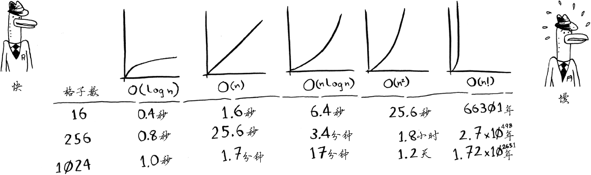

### algorithm time image

- 算法的速度指的并非时间，而是操作数的增速。

- 谈论算法的速度时，我们说的是随着输入的增加，其运行时间将以什么样的速度增加。
- 算法的运行时间用大 O 表示法表示。
- O(logn)比O(n) 快，当需要搜索的元素越多时，前者比后者快得越多。

### special example

- binary search: O(logn)