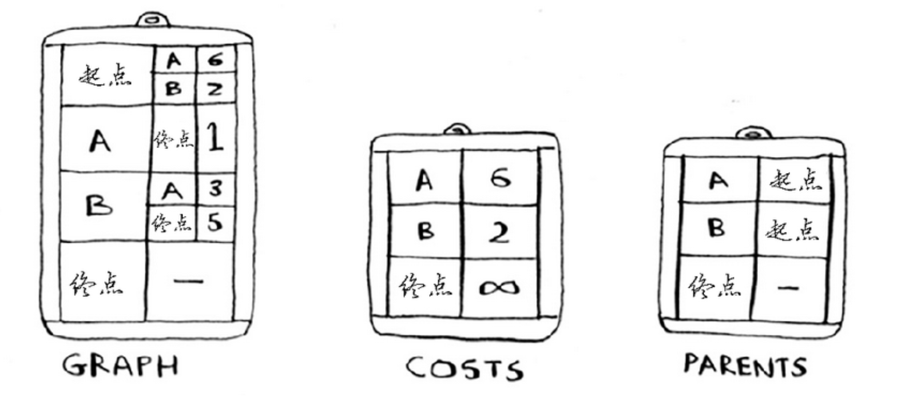
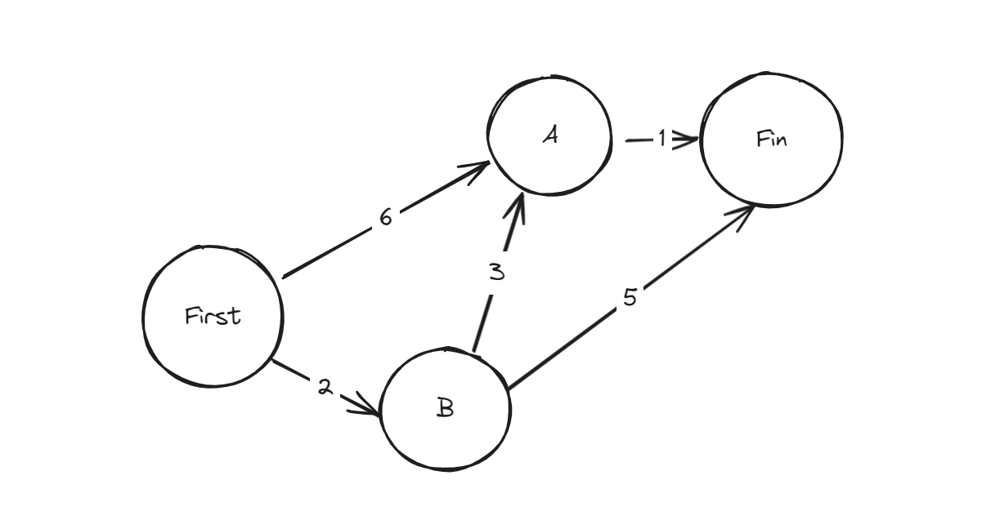

### dijkstra(狄克斯特拉算法)

- 有向图，有权重(不可为复)
- 用于在加权图中查找最短路径





```javascript
// create hash table(graph)
// assigned value for every node
let graph = {}
// first
graph['First'] = {}
graph['First']['A'] = 6
graph['First']['B'] = 2
// A
graph['A'] = {}
graph['A']['Fin'] = 1
// B
graph['B'] = {}
graph['B']['A'] = 3
graph['B']['Fin'] = 5
// Fin
graph['Fin'] = {}
// costs
let costs = {}
costs['A'] = 6
costs['B'] = 2
costs['Fin'] = Infinity

// parents
let parents = {}
parents['A'] = 'First'
parents['B'] = 'First'
parents['Fin'] = null

let processed = []
// calc min cost
const getMinCost = (costs) => {
  let lowestCost = Infinity
  let lowestCostNode = null

  for(let node in costs) {
    let curCost = costs[node]
    if(curCost < lowestCost && !processed.includes(node)) {
      lowestCost = curCost
      lowestCostNode = node
    }
  }
  return lowestCostNode
}

let minNode = getMinCost(costs)

while(minNode) {
  const cost = costs[minNode]
  const neighbor = graph[minNode]
  Object.keys(neighbor).forEach(function(item){
    const new_cost = neighbor[item] + cost
    if(new_cost < costs[item]) {
      costs[item] = new_cost
      parents[item] = minNode
    }
  })
  processed.push(minNode)
  minNode = getMinCost(costs)
}
// Fin's min cost is:
console.log("Fin's min cost is:", costs['Fin'])
```