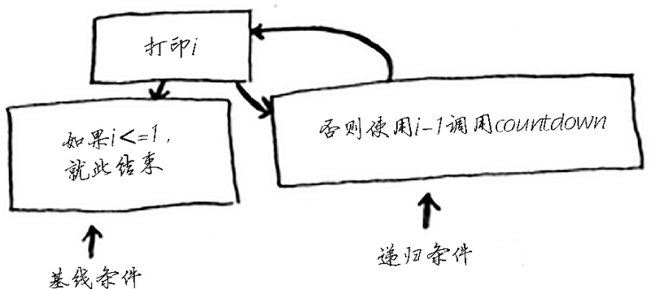
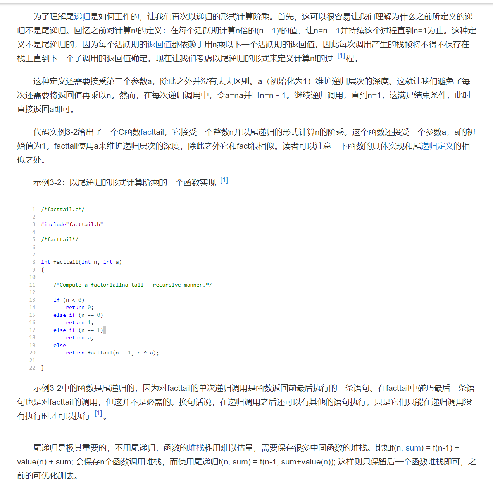

### algorithm time image



- 编写递归函数时，必须告诉它何时停止递归。正因为如此，每个递归函数都有两部分：基线条件（base case）和递归条件（recursive case）
```javascript
function countdown(i):
	console.log(i)
	if i <= 1:  // ←------基线条件
		return
	else:  // ←------递归条件
		countdown(i-1)
```

### tail recursive call

```javascript
// 阶层 factCall(3)
// 调用栈 每一次调用的返回值都需要依赖n * 下一次调用的返回值
// factCall(1) => 1
// 1 * factCall(2) => 2
// 2 * factCall(3) => 6
function factCall(n) {
  if(n == 1) {
    return 1
  } else {
    return n* factCall(n - 1)
  }
}

// 尾调用 factTailCall(3)
// 调用栈 每次的返回值跟下一次调用的返回值无关
// factTailCall(1, 6) => 6
// factTailCall(2, 3)
// factTailCall(3, 1)
function factTailCall(n, sum = 1) {
  if(n == 0) return 1
  else if(n == 1) {
    return sum
  }else {
    return factTailCall(n - 1, sum * n)
  }
}
```


### D&C Algorithm (分治算法)
```
1. D&C 将问题逐步分解。使用 D&C 处理列表时，基线条件很可能是空数组或只包含一个元素的数组。
2. 
```
### special example


