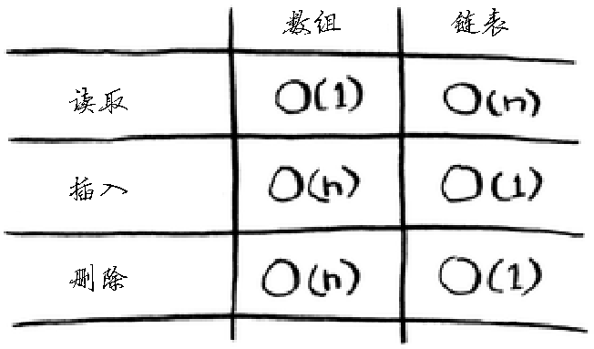

### algorithm time image

- 计算机内存犹如一大堆抽屉；
- 需要存储多个元素时，可使用数组或链表；
- 数组的元素都在一起；
- 链表的元素是分开的，其中每个元素都存储了下一个元素的地址；
- 数组的读取速度很快；
- 链表的插入和删除速度很快；
- 在同一个数组中，所有元素的类型都必须相同（都为 int、double 等）。

### Example
#### which sort way is used by sort function? sort方法采用的什么排序？
#### array sort 冒泡排序
#### array sort 选择排序
#### array sort 插入排序
#### array sort 归并排序
#### array sort 快速排序
```javascript
function quickSort(array) {
    // ----> base case 基线条件
    if(array.length < 2) return array       

    // ----> recursive case 递归条件
    let pivot = array[0]

    let left = array.slice(1).filter(item => item <= pivot)
    let right = array.slice(1).filter(item => item > pivot)

    return [...quickSort(left), pivot, ...quickSort(right)]
}
```
#### chain sort 链表的归并排序
```javascript
/**
 * Definition for singly-linked list.
 * function ListNode(val, next) {
 *     this.val = (val===undefined ? 0 : val)
 *     this.next = (next===undefined ? null : next)
 * }
 */
/**
 * @param {ListNode} head
 * @return {ListNode}
 */


 var mergeSort = function(head1, head2) {
    const dummyHead = new ListNode(0);
    let temp = dummyHead, temp1 = head1, temp2 = head2;
    while(temp1 != null && temp2 != null) {
        if(temp1.val <= temp2.val) {
            temp.next = temp1
            temp1 = temp1.next
        } else {
            temp.next = temp2
            temp2 = temp2.next
        }
        temp = temp.next
    }

    if(temp1 != null) {
        temp.next = temp1
    }else if(temp2 != null) {
        temp.next = temp2
    }

    return dummyHead.next
}
const toSortList = function(head, tail) {
    if (head === null){
        return head;
    }

    if(head.next === tail) {
        head.next = null
        return head;
    }
    let slow = head, fast = head;
    while(fast !== tail) {
        slow = slow.next
        fast = fast.next
        if(fast !== tail) {
            fast = fast.next
        }
    }
    const mid = slow
    return mergeSort(toSortList(head, mid), toSortList(mid, tail))
}

var sortList = function(head) {
    return toSortList(head, null)
};

```

#### chain sort 链表的插入排序
```javascript
/**
 * Definition for singly-linked list.
 * function ListNode(val, next) {
 *     this.val = (val===undefined ? 0 : val)
 *     this.next = (next===undefined ? null : next)
 * }
 */
/**
 * @param {ListNode} head
 * @return {ListNode}
 */
var insertionSortList = function(head) {
    // head 不存在，直接返回
    if(head == null) return head

    const dummyHead = new ListNode(0)
    dummyHead.next = head;
    let lastSorted = head;
    let cur = head.next

    while(cur !== null) {
        if(lastSorted.val <= cur.val) {
            lastSorted = lastSorted.next
        } else {
            let prev = dummyHead;
            while(prev.next.val <= cur.val) {
                prev = prev.next
            }
            lastSorted.next = cur.next
            cur.next = prev.next
            prev.next = cur
        }
        cur = lastSorted.next
    }
    return dummyHead.next
};
```

### when to use chain dummyHead? 什么时候使用dummy头节点?
